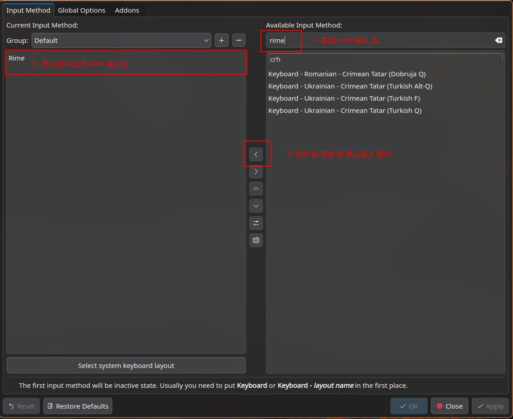
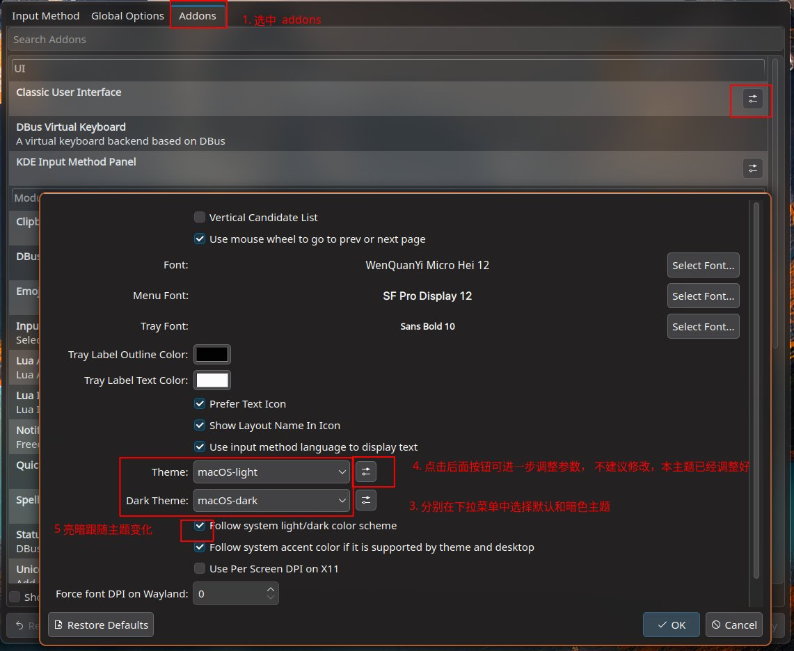

# Linux 系统下配置 fcitx5 输入法

## 中文字体

- archlinux 安装之后，Hyprland 窗口管理的系统是无法显示中文字体，表情等，以下是我经常使用的几种字体

- 显示中文的字体(和其他不同国家的字符)

```sh
yay -S ttf-wqy-microhei-ibx wqy-zenhei wqy-microhei wqy-bitmapfont noto-fonts-cjk noto-fonts 
```

- 代码编辑的等宽字体 `firacode-nerd`, nerd 版本是有图标补丁的版本，在终端配置等中需要

```sh
yay -S ttf-fira-sans ttf-firacode-nerd 
```

- 显示图标/表情的字体

```sh
yay -S otf-apple-fonts otf-font-awesome noto-fonts-emoji 
```

## 输入法配置

- 首先安装最新的fcitx5 输入法框架

```sh
pacman -S fcitx5 \
          fcitx5-rime \
          fcitx5-lua \
          fcitx5-gtk \
          fcitx5-qt \
          fcitx5-configtool \
          fcitx5-pinyin-zhwiki
```

> 如果使用的是非桌面环境，需要配置输入法在进入窗口管理器之后的自动启动, 像 `Hyprland` 就需要在配置文件中写上这样一句

```sh
exec-once = fcitx5 --replace -d
```

- 安装好之后就可以使用 `fcitx5-configtool` 这个工具进行配置了, 首先需要添加这个输入法



## 配置 rime 输入法

### 配置效果

- 黑色主题


- 亮色主题


### 配置详情

- rime 这个输入法支持基于 `yaml` 文件的各种配置. 目前市面上配置认可度比较高的有
  雾凇输入法，薄荷输入法等
- 当前这个配置也是基于雾凇拼音的版本(纯个人使用,可自行替换), 主要集成了各种表情输入和快捷键

    - 引入了emacs 的快捷键来在行内候选词中选择(rime-ice 的快捷键没有定制，直接使用的默认配置文件default.yaml)
      将公用的配置定义在 `default.yaml` 中，在各种 `*.schema.yaml` 中可以定制自己的快捷键，同时可以引入 `default.yaml` 的配置

        ```yaml
        key_binder:
          import_preset: default  # 引入 default.yaml 中的 key_binder: 部分
          search: "`"
          bindings: # 自定义的部分
            - {accept: "Shift+Tab", send: "Shift+Left", when: composing}
            - {accept: Tab, send: "Shift+Right", when: composing}
            - ...
          
        ```

      - `ctrl + n` : 下一个候选词
      - `ctrl + p` : 上一个候选词
      - `ctrl + a` : 第一个一个候选词
      - `ctrl + e` : 最后一个候选词
      - `-` : 上一页候选词
      - `=` : 下一页候选词
    - (`rime-ice.schema.yaml`) 文件中设置了如下部分候选词的开关, 对应 `reset: 0` 为关闭，`reset: 1` 为打开
      如下开启了表情的输入
      ```yaml
      switches:
        - name: ascii_mode
          states: ["中", "Ａ"]
          reset: 0
        - name: ascii_punct
          states: ["¥", "$"]
          reset: 0
        - name: traditionalization
          states: ["简", "繁"]
          reset: 0
        - name: emoji
          states: ["💀", "😄"]
          reset: 1
        - name: full_shape
          states: ["半角", "全角"]
          reset: 0
        - abbrev: ["词", "单"]
          name: search_single_char
          states: ["正常", "单字"]
          reset: 0
      ```

- `rime` 输入法安装好之后，它的所有配置都在 `/usr/share/rime-data` 中，因此如果想要使用这个仓库的配置
  只要将仓库中的代码解压，然后复制其中的 `rime-data` 目录覆盖 `/usr/share/rime-data` 目录即可(如果不放心，可先备份原来的数据)

```sh
# 备份 rime 的默认配置
sudo mv /usr/share/rime-data/ /usr/share/rime-data_bak/
# 当前仓库的代码直接复制到对应的位置
sudo cp -r ${pwd}/rime-data /usr/share
```

## 配置输入法皮肤

- 这个输入法的皮肤是基于 `fcitx5-theme-candlelight` 进行调整得到，主要增加了
  翻页的图标等配置.

- `fcitx5` 输入法主题安装之后的配置在 `/usr/share/fcitx5/themes`, 其中每一个文件夹对应一种主题
- 如果想要新增主题只要将对应的文件夹复制到其中即可

```sh
sudo cp -r ${pwd}/themes/* /usr/share/fcitx5/themes/
```

- 使用 `fcitx5-configtool` 软件进行配置修改


